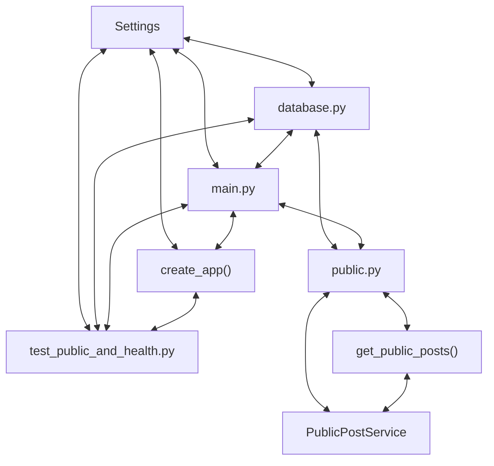

# Codebase Architectural Report

> **Auto-generated** by graphify knowledge graph analysis  
> **Purpose**: Dependency map, connection analysis, subsystem breakdown, and quality hotspots.

---

## 1. Executive Summary

- **Total Components**: `135`
- **Total Connections**: `264`
- **Subsystem Modules**: `1`
- **Dependency Types**: `10`

**Key Architectural Hubs:**

| # | Component | File | Type | Connections |
|---|-----------|------|------|-------------|
| 1 | `test_public_and_health.py` | `backend/tests/test_public_and_health.py` | file | 17 |
| 2 | `main.py` | `backend/app/main.py` | file | 16 |
| 3 | `Settings` | `backend/app/config.py` | class | 12 |
| 4 | `database.py` | `backend/app/database.py` | file | 12 |
| 5 | `public.py` | `backend/app/routers/public.py` | file | 12 |
| 6 | `get_public_posts()` | `backend/app/routers/public.py` | method | 11 |
| 7 | `create_app()` | `backend/app/main.py` | method | 10 |
| 8 | `PublicPostService` | `backend/app/services/posts.py` | class | 10 |

---

## 2. Dependency & Connection Analysis

### Relationship Types

| Relationship | Count | Share |
|-------------|-------|-------|
| `contains` | 57 | 22% |
| `rationale_for` | 47 | 18% |
| `imports` | 43 | 16% |
| `references` | 40 | 15% |
| `imports_from` | 32 | 12% |
| `calls` | 24 | 9% |
| `inherits` | 6 | 2% |
| `uses` | 6 | 2% |
| `method` | 5 | 2% |
| `re_exports` | 4 | 2% |

### Hub Dependency Diagram

### Most Connected Pairs

| Component A | Component B | Shared Connections |
|-------------|-------------|-------------------|
| `WriteSpace backend application package.` | `app/__init__.py` | 1 |
| `config.py` | `get_settings()` | 1 |
| `Settings` | `config.py` | 1 |
| `Application configuration loaded from the backend dotenv contract.` | `config.py` | 1 |
| `config.py` | `database.py` | 1 |
| `config.py` | `main.py` | 1 |
| `config.py` | `test_public_and_health.py` | 1 |
| `Settings` | `get_settings()` | 1 |
| `Runtime settings for database access, seeding, and browser access.` | `Settings` | 1 |
| `.allowed_origins()` | `Settings` | 1 |

---

## 3. Subsystem & Module Breakdown

### 3.1 backend/app
**Nodes**: `135`  
**Files**: `.engine/workers/01bef94c181e/scratch/findings.md`, `backend/app/__init__.py`, `backend/app/config.py`, `backend/app/database.py`, `backend/app/errors.py`, `backend/app/main.py` +26 more

| Component | Type | File | Connections |
|-----------|------|------|-------------|
| `test_public_and_health.py` | file | `backend/tests/test_public_and_health.py` | 17 |
| `main.py` | file | `backend/app/main.py` | 16 |
| `Settings` | class | `backend/app/config.py` | 12 |
| `database.py` | file | `backend/app/database.py` | 12 |
| `public.py` | file | `backend/app/routers/public.py` | 12 |
| `get_public_posts()` | method | `backend/app/routers/public.py` | 11 |
| `create_app()` | method | `backend/app/main.py` | 10 |
| `PublicPostService` | class | `backend/app/services/posts.py` | 10 |
| `make_client()` | method | `backend/tests/test_public_and_health.py` | 10 |
| `create_session_factory()` | method | `backend/app/database.py` | 9 |

**External dependencies:** `WriteSpace backend application package.` (1), `Application configuration loaded from the backend dotenv contract.` (1), `Runtime settings for database access, seeding, and browser access.` (1), `Return non-empty browser origins parsed from the environment.` (1), `Return the process-wide settings instance for the default app.` (1)

---

## 4. API Reference

Public classes and functions by subsystem.

### backend/app

| Name | Type | File | Connections |
|------|------|------|-------------|
| `Settings` | class | `backend/app/config.py` | 12 |
| `PublicPostService` | class | `backend/app/services/posts.py` | 10 |
| `LandingPage.jsx` | class | `frontend/src/pages/LandingPage.jsx` | 9 |
| `Base` | class | `backend/app/database.py` | 8 |
| `Post` | class | `backend/app/models.py` | 8 |
| `PostRepository` | class | `backend/app/repositories/posts.py` | 8 |
| `PublicPostPreview` | class | `backend/app/schemas.py` | 8 |
| `devDependencies` | function | `frontend/package.json` | 8 |

---

## 5. Code Quality & Architectural Risk Hotspots

### Component Type Distribution

| Type | Count | Share |
|------|-------|-------|
| function | 47 | 35% |
| class | 40 | 30% |
| method | 26 | 19% |
| file | 22 | 16% |

### High-Connectivity Hotspots

**2** component(s) with >15 connections:

| Component | File | Connections |
|-----------|------|-------------|
| `test_public_and_health.py` | `backend/tests/test_public_and_health.py` | 17 |
| `main.py` | `backend/app/main.py` | 16 |

### Dependency Cycles

**99** circular dependency loop(s) detected:

| # | Cycle Path |
|---|-----------|
| 1 | `frontend_src_pages_landingpage → frontend_src_pages_landingpage_landingpage → frontend_src_pages_landingpage_test` |
| 2 | `frontend_src_pages_landingpage → frontend_src_app → frontend_src_pages_landingpage_landingpage` |
| 3 | `frontend_src_app_app → frontend_src_main → frontend_src_app` |
| 4 | `frontend_src_api_posts → frontend_src_pages_landingpage → frontend_src_pages_landingpage_test` |
| 5 | `frontend_src_api_posts_getpublicpreviews → frontend_src_pages_landingpage → frontend_src_pages_landingpage_test` |
| 6 | `frontend_src_components_publicnavbar → frontend_src_components_publicnavbar_publicnavbar → frontend_src_pages_landingpage` |
| 7 | `frontend_src_components_blogcard → frontend_src_components_blogcard_blogcard → frontend_src_pages_landingpage` |
| 8 | `frontend_src_components_blogcard → frontend_src_components_blogcard_formatdate → frontend_src_components_blogcard_blogcard` |
| 9 | `frontend_src_api_posts → frontend_src_api_posts_getpublicpreviews → frontend_src_pages_landingpage_test` |
| 10 | `frontend_src_api_posts → frontend_src_api_client_getjson → frontend_src_api_posts_getpublicpreviews` |

### Orphaned Components

**10** isolated node(s) with no connections:

| Component | File |
|-----------|------|
| `public.spec.js` | `frontend/e2e/public.spec.js` |
| `playwright.config.js` | `frontend/playwright.config.js` |
| `testSetup.js` | `frontend/src/testSetup.js` |
| `vite.config.js` | `frontend/vite.config.js` |
| `vitest.config.js` | `frontend/vitest.config.js` |
| `auth-session` | `todos.yaml` |
| `authenticated-reading` | `todos.yaml` |
| `writer-crud` | `todos.yaml` |
| `Backend Healthcheck` | `docker-compose.yml` |
| `Safe Public Post Projection` | `.engine/workers/01bef94c181e/scratch/findings.md` |

---

## 6. How to Navigate

1. **Interactive D3 Map** — open `graph.html` to explore node connections visually.
2. **Knowledge Graph Queries** — use MCP tools (`graph_query`, `graph_explain_node`, `graph_impact_radius`).
